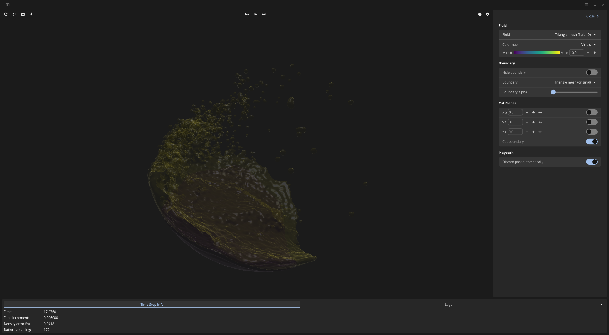

# Sci-Phi

An SPH fluid simulation application with interactive 3D visualization.

## Overview

`sci-phi` is the main simulation binary of the workspace. It loads a scene configuration, runs the SPH fluid solver on a dedicated worker thread, and renders results in real time using a libcosmic-based desktop application with custom wgpu rendering.

<div align="center">
  
</div>
## Architecture

```
┌──────────────────────────────────────────────────────────────┐
│              cosmic::Application (Event Loop)                │
├─────────────────────────────┬────────────────────────────────┤
│      Frontend (UI Thread)   │      Backend (Worker Thread)   │
│                             │                                │
│  - COSMIC desktop UI        │  - SPH Simulation              │
│  - Shader widget (wgpu 3D)  │  - Measurement export          │
│  - Playback control         │  - Recording                   │
│  - Camera interaction       │  - State saving                │
│                             │                                │
│    WorkerCommand ──────────►│                                │
│                             │◄──── WorkerMessage             │
│    (crossbeam channel)      │      (crossbeam channel)       │
└─────────────────────────────┴────────────────────────────────┘
```

- **UI thread** — libcosmic application with a `shader::Program` widget for 3D rendering, COSMIC-styled controls, and input handling.
- **Worker thread** — runs the simulation loop, sends completed time steps back via a crossbeam channel polled by a Subscription.
- **Communication** — `crossbeam` channels in both directions, polled asynchronously through iced Subscriptions.

### Rendering Pipeline

```
FluidViewport (Program)
  └→ FluidFrame (Primitive) ─── created each frame
       └→ FluidRenderer (Pipeline) ─── persistent GPU resources
            ├── Particle impostor pipeline
            ├── Mesh opaque/transparent pipelines
            ├── Light indicator pipeline
            └── Depth texture, bind groups, uniform buffers
```

## Usage

```bash
cargo run --release -p sci-phi -- <PARAMS> --scene <SCENE> [OPTIONS]
```

### Positional Arguments

| Argument | Description |
|----------|-------------|
| `PARAMS` | Path to a `.toml` file with simulation parameters |

### Required Options

| Option | Description |
|--------|-------------|
| `--scene <FILE>` | Path to the scene definition `.toml` file |

### Optional Flags

| Option | Short | Description |
|--------|-------|-------------|
| `--state <FILE>` | | Path to a saved particle state file to resume from |
| `--measurement-file <FILE>` | `-m` | Path to a `.csv` file for measurement output |
| `--recording-file <FILE>` | | Path to a binary file for recording time step data |
| `--rendering-dir <DIR>` | | Directory to store rendered frames as `.png` files |
| `--start-time <T>` | `-s` | Simulation time at which measurement/recording/rendering begins |
| `--finish-time <T>` | `-f` | Simulation time at which measurement/recording/rendering ends (pauses simulation) |
| `--resume` | `-r` | Start playback immediately (unpaused) |
| `--exit` | `-e` | Exit the application automatically when `finish_time` is reached |
| `--log <LEVEL>` | `-l` | Log severity: `TRACE`, `DEBUG`, `INFO`, `WARN`, `ERROR`, `OFF` (default: `INFO`) |

### Examples

```bash

### Run with a scene config

cargo run --release -p sci-phi -- params.toml --scene scene.toml

### Run with recording and auto-exit

cargo run --release -p sci-phi -- params.toml --scene scene.toml \
    --recording-file sim.bin \
    --start-time 0.5 --finish-time 3.0 --exit

### Resume from a saved state with measurement export

cargo run --release -p sci-phi -- params.toml --scene scene.toml \
    --state checkpoint.ron \
    --measurement-file results.csv --resume

### Render frames to a directory

cargo run --release -p sci-phi -- params.toml --scene scene.toml \
    --rendering-dir ./frames --start-time 0.0 --finish-time 5.0 --exit
```

## UI

The application uses the [libcosmic](https://github.com/pop-os/libcosmic) toolkit.

### Keyboard Shortcuts

| Key | Action |
|-----|--------|
| `W` / `↑` | Camera forward |
| `S` / `↓` | Camera backward |
| `A` / `←` | Camera left |
| `D` / `→` | Camera right |
| `Space` | Camera up |
| `Shift` | Camera down |
| Right-click + drag | Camera rotation |
| Scroll wheel | Camera zoom |

## Dependencies

| Crate | Purpose |
|-------|---------|
| `clap` | CLI argument parsing |
| `libcosmic` | COSMIC desktop UI framework (includes iced + wgpu) |
| `crossbeam` | Channel-based communication between threads |
| `tracing` / `tracing-subscriber` | Structured logging |
| `rendering_lib` | wgpu-based 3D rendering via shader widget (workspace crate) |
| `simulation_lib` | SPH simulation backend (workspace crate) |
| `image` | PNG export for screenshots |
